# 전기차 통합 탐색적 데이터 분석 (EDA) 보고서

본 보고서는 7가지 원시 데이터셋에 대한 py-eda 스킬 기반의 통합 탐색적 데이터 분석 결과를 포함합니다.

## 전기차 사용자 충전 패턴 데이터 (ev_charging_patterns.csv)

### 1. 기본 정보 및 데이터 구조

- **데이터 크기**: 1,320행, 20열
- **중복 데이터 수**: 0개

**[데이터 Info]**
```
<class 'pandas.DataFrame'>
RangeIndex: 1320 entries, 0 to 1319
Data columns (total 20 columns):
 #   Column                                    Non-Null Count  Dtype  
---  ------                                    --------------  -----  
 0   User ID                                   1320 non-null   str    
 1   Vehicle Model                             1320 non-null   str    
 2   Battery Capacity (kWh)                    1320 non-null   float64
 3   Charging Station ID                       1320 non-null   str    
 4   Charging Station Location                 1320 non-null   str    
 5   Charging Start Time                       1320 non-null   str    
 6   Charging End Time                         1320 non-null   str    
 7   Energy Consumed (kWh)                     1254 non-null   float64
 8   Charging Duration (hours)                 1320 non-null   float64
 9   Charging Rate (kW)                        1254 non-null   float64
 10  Charging Cost (USD)                       1320 non-null   float64
 11  Time of Day                               1320 non-null   str    
 12  Day of Week                               1320 non-null   str    
 13  State of Charge (Start %)                 1320 non-null   float64
 14  State of Charge (End %)                   1320 non-null   float64
 15  Distance Driven (since last charge) (km)  1254 non-null   float64
 16  Temperature (°C)                          1320 non-null   float64
 17  Vehicle Age (years)                       1320 non-null   float64
 18  Charger Type                              1320 non-null   str    
 19  User Type                                 1320 non-null   str    
dtypes: float64(10), str(10)
memory usage: 354.1 KB
```

**[상위 5개 행]**
|    | User ID   | Vehicle Model   |   Battery Capacity (kWh) | Charging Station ID   | Charging Station Location   | Charging Start Time   | Charging End Time   |   Energy Consumed (kWh) |   Charging Duration (hours) |   Charging Rate (kW) |   Charging Cost (USD) | Time of Day   | Day of Week   |   State of Charge (Start %) |   State of Charge (End %) |   Distance Driven (since last charge) (km) |   Temperature (°C) |   Vehicle Age (years) | Charger Type    | User Type              |
|---:|:----------|:----------------|-------------------------:|:----------------------|:----------------------------|:----------------------|:--------------------|------------------------:|----------------------------:|---------------------:|----------------------:|:--------------|:--------------|----------------------------:|--------------------------:|-------------------------------------------:|-------------------:|----------------------:|:----------------|:-----------------------|
|  0 | User_1    | BMW i3          |                  108.463 | Station_391           | Houston                     | 2024-01-01 00:00:00   | 2024-01-01 00:39:00 |                 60.7123 |                    0.591363 |              36.3892 |               13.0877 | Evening       | Tuesday       |                     29.3716 |                   86.12   |                                   293.602  |            27.948  |                     2 | DC Fast Charger | Commuter               |
|  1 | User_2    | Hyundai Kona    |                  100     | Station_428           | San Francisco               | 2024-01-01 01:00:00   | 2024-01-01 03:01:00 |                 12.3393 |                    3.13365  |              30.6777 |               21.1284 | Morning       | Monday        |                     10.1158 |                   84.6643 |                                   112.113  |            14.311  |                     3 | Level 1         | Casual Driver          |
|  2 | User_3    | Chevy Bolt      |                   75     | Station_181           | San Francisco               | 2024-01-01 02:00:00   | 2024-01-01 04:48:00 |                 19.1289 |                    2.45265  |              27.5136 |               35.6673 | Morning       | Thursday      |                      6.8546 |                   69.9176 |                                    71.7993 |            21.002  |                     2 | Level 2         | Commuter               |
|  3 | User_4    | Hyundai Kona    |                   50     | Station_327           | Houston                     | 2024-01-01 03:00:00   | 2024-01-01 06:42:00 |                 79.4578 |                    1.26643  |              32.8829 |               13.0362 | Evening       | Saturday      |                     83.12   |                   99.6243 |                                   199.578  |            38.3163 |                     1 | Level 1         | Long-Distance Traveler |
|  4 | User_5    | Hyundai Kona    |                   50     | Station_108           | Los Angeles                 | 2024-01-01 04:00:00   | 2024-01-01 05:46:00 |                 19.6291 |                    2.01977  |              10.2157 |               10.1615 | Morning       | Saturday      |                     54.2589 |                   63.7438 |                                   203.662  |            -7.8342 |                     1 | Level 1         | Long-Distance Traveler |

**[하위 5개 행]**
|      | User ID   | Vehicle Model   |   Battery Capacity (kWh) | Charging Station ID   | Charging Station Location   | Charging Start Time   | Charging End Time   |   Energy Consumed (kWh) |   Charging Duration (hours) |   Charging Rate (kW) |   Charging Cost (USD) | Time of Day   | Day of Week   |   State of Charge (Start %) |   State of Charge (End %) |   Distance Driven (since last charge) (km) |   Temperature (°C) |   Vehicle Age (years) | Charger Type    | User Type     |
|-----:|:----------|:----------------|-------------------------:|:----------------------|:----------------------------|:----------------------|:--------------------|------------------------:|----------------------------:|---------------------:|----------------------:|:--------------|:--------------|----------------------------:|--------------------------:|-------------------------------------------:|-------------------:|----------------------:|:----------------|:--------------|
| 1315 | User_1316 | Nissan Leaf     |                  100     | Station_57            | New York                    | 2024-02-24 19:00:00   | 2024-02-24 20:30:00 |                 42.0117 |                     1.42644 |              5.89548 |              22.0812  | Evening       | Sunday        |                     39.2041 |                   83.916  |                                   239.601  |            1.91965 |                     7 | DC Fast Charger | Commuter      |
| 1316 | User_1317 | BMW i3          |                  100     | Station_40            | New York                    | 2024-02-24 20:00:00   | 2024-02-24 20:44:00 |                 68.1859 |                     3.23821 |             18.388   |               5.06781 | Evening       | Tuesday       |                     31.4564 |                   93.0965 |                                   164.376  |           34.0298  |                     4 | Level 2         | Casual Driver |
| 1317 | User_1318 | Nissan Leaf     |                  100     | Station_374           | New York                    | 2024-02-24 21:00:00   | 2024-02-24 23:03:00 |                 18.8951 |                     3.26712 |             45.4821  |              37.255   | Evening       | Tuesday       |                     71.9031 |                   78.6789 |                                   226.519  |           20.3588  |                     5 | DC Fast Charger | Commuter      |
| 1318 | User_1319 | Chevy Bolt      |                   85     | Station_336           | San Francisco               | 2024-02-24 22:00:00   | 2024-02-24 23:20:00 |                 13.7563 |                     2.75453 |             38.1482  |              39.0461  | Afternoon     | Sunday        |                     76.188  |                   65.9266 |                                   291.494  |           24.1346  |                     5 | Level 2         | Commuter      |
| 1319 | User_1320 | Nissan Leaf     |                  120.447 | Station_128           | Los Angeles                 | 2024-02-24 23:00:00   | 2024-02-24 23:56:00 |                 63.6526 |                     3.74097 |             33.7042  |              10.8637  | Evening       | Monday        |                     59.3381 |                   56.6924 |                                    14.4492 |           -6.96659 |                     5 | DC Fast Charger | Commuter      |

### 2. 기술 통계량

**[수치형 정보]**
|       |   Battery Capacity (kWh) |   Energy Consumed (kWh) |   Charging Duration (hours) |   Charging Rate (kW) |   Charging Cost (USD) |   State of Charge (Start %) |   State of Charge (End %) |   Distance Driven (since last charge) (km) |   Temperature (°C) |   Vehicle Age (years) |
|:------|-------------------------:|------------------------:|----------------------------:|---------------------:|----------------------:|----------------------------:|--------------------------:|-------------------------------------------:|-------------------:|----------------------:|
| count |               1320       |            1254         |                1320         |           1254       |           1320        |                  1320       |                1320       |                                1254        |         1320       |            1320       |
| mean  |                 74.5347  |              42.6429    |                   2.26938   |             25.963   |             22.5514   |                    49.13    |                  75.1416  |                                 153.597    |           15.2636  |               3.61284 |
| std   |                 20.6269  |              22.4117    |                   1.06104   |             14.0113  |             10.7515   |                    24.0741  |                  17.0806  |                                  86.005    |           14.8312  |               2.30982 |
| min   |                  1.53281 |               0.0457718 |                   0.0953144 |              1.47255 |              0.234317 |                     2.32596 |                   7.60422 |                                   0.862361 |          -10.7248  |               0       |
| 25%   |                 62       |              23.8812    |                   1.39762   |             13.8566  |             13.3681   |                    27.7869  |                  62.0533  |                                  79.4453   |            2.80066 |               2       |
| 50%   |                 75       |              42.6914    |                   2.25814   |             25.6038  |             22.0764   |                    48.2418  |                  75.6825  |                                 152.26     |           14.6308  |               4       |
| 75%   |                 85       |              61.2062    |                   3.11281   |             37.503   |             31.646    |                    69.2779  |                  88.2014  |                                 226.073    |           27.9818  |               6       |
| max   |                193.003   |             152.239     |                   7.63514   |             97.3423  |             69.4077   |                   152.49    |                 177.709   |                                 398.365    |           73.1696  |              11.6886  |

**[범주형 정보]**
|        | User ID   | Vehicle Model   | Charging Station ID   | Charging Station Location   | Charging Start Time   | Charging End Time   | Time of Day   | Day of Week   | Charger Type   | User Type   |
|:-------|:----------|:----------------|:----------------------|:----------------------------|:----------------------|:--------------------|:--------------|:--------------|:---------------|:------------|
| count  | 1320      | 1320            | 1320                  | 1320                        | 1320                  | 1320                | 1320          | 1320          | 1320           | 1320        |
| unique | 1320      | 5               | 462                   | 5                           | 1320                  | 1309                | 4             | 7             | 3              | 3           |
| top    | User_1    | Tesla Model 3   | Station_108           | Los Angeles                 | 2024-01-01 00:00:00   | 2024-01-03 12:59:00 | Evening       | Saturday      | Level 1        | Commuter    |
| freq   | 1         | 280             | 9                     | 297                         | 1                     | 2                   | 362           | 205           | 459            | 476         |

### 3. 세부 특성 및 시각화 분석

#### 시각화 1: 차량 모델별 충전 세션 빈도

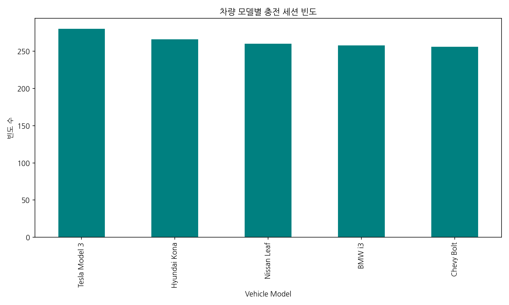

**관련 데이터 표**

| Vehicle Model   |   count |
|:----------------|--------:|
| Tesla Model 3   |     280 |
| Hyundai Kona    |     266 |
| Nissan Leaf     |     260 |
| BMW i3          |     258 |
| Chevy Bolt      |     256 |

**분석 해석:**
본 차트는 전체 충전 세션에서 가장 많이 등장하는 상위 30개의 전기차 모델별 이용 횟수를 보여줍니다. 특정 모델이 압도적으로 많이 이용되는 경향이 있는지 파악할 수 있으며, 주력 모델 기반의 충전소 맞춤형 서비스 기획 및 프로모션 타겟팅에 주요 지표로 활용될 수 있는 중요한 분석 결과입니다. 이를 통해 해당 시장에서 어떤 차량이 가장 충전을 활발하게 하는지 뚜렷하게 관측할 수 있습니다.

#### 시각화 2: 충전 소요 시간과 소비 전력량의 관계

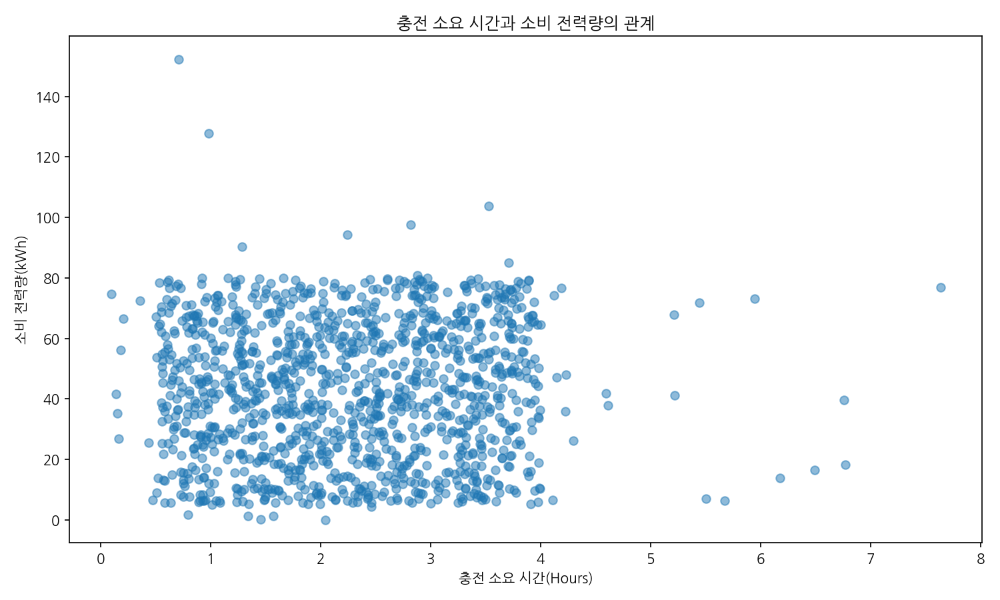

**관련 통계 표**

|       |   Charging Duration (hours) |   Energy Consumed (kWh) |
|:------|----------------------------:|------------------------:|
| count |                1254         |            1254         |
| mean  |                   2.27861   |              42.6429    |
| std   |                   1.06562   |              22.4117    |
| min   |                   0.0953144 |               0.0457718 |
| 25%   |                   1.40018   |              23.8812    |
| 50%   |                   2.28212   |              42.6914    |
| 75%   |                   3.13363   |              61.2062    |
| max   |                   7.63514   |             152.239     |

**분석 해석:**
충전 시간과 소모 단량의 분포를 흩뿌린 산점도입니다. 우상향하는 추세를 통해 충전 시간이 길어질수록 충전 전력량이 선형적으로 증가한다는 보편적인 결과를 입증합니다. 다만 간혹 동일 시간에 대비 낮거나 높은 형태의 아웃라이어들이 존재하는데, 이는 완속/급속 충전기의 다양한 유형 차이 또는 배터리 잔량의 과도 방전 후 충전 상황 등 이질적인 요소가 있음을 알 수 있게 해주는 유의미한 형태입니다.

## 전기차 기본 보급 데이터 (EV_Population.csv)

### 1. 기본 정보 및 데이터 구조

- **데이터 크기**: 92,676행, 8열
- **중복 데이터 수**: 81,338개

**[데이터 Info]**
```
<class 'pandas.DataFrame'>
RangeIndex: 92676 entries, 0 to 92675
Data columns (total 8 columns):
 #   Column                   Non-Null Count  Dtype  
---  ------                   --------------  -----  
 0   State                    92676 non-null  str    
 1   Model Year               92676 non-null  int64  
 2   Make                     92676 non-null  str    
 3   Electric Vehicle Type    92676 non-null  str    
 4   Electric Range           92676 non-null  int64  
 5   Base MSRP                92676 non-null  int64  
 6   Legislative District     92676 non-null  float64
 7   CAFV Eligibility Simple  92676 non-null  str    
dtypes: float64(1), int64(3), str(4)
memory usage: 7.4 MB
```

**[상위 5개 행]**
|    | State   |   Model Year | Make      | Electric Vehicle Type   |   Electric Range |   Base MSRP |   Legislative District | CAFV Eligibility Simple   |
|---:|:--------|-------------:|:----------|:------------------------|-----------------:|------------:|-----------------------:|:--------------------------|
|  0 | WA      |         2020 | TESLA     | BEV                     |              266 |           0 |                     46 | Eligible                  |
|  1 | WA      |         2024 | BMW       | PHEV                    |               39 |           0 |                     46 | Eligible                  |
|  2 | WA      |         2024 | BMW       | PHEV                    |               39 |           0 |                     43 | Eligible                  |
|  3 | WA      |         2018 | TESLA     | BEV                     |              215 |           0 |                      1 | Eligible                  |
|  4 | WA      |         2012 | CHEVROLET | PHEV                    |               35 |           0 |                     35 | Eligible                  |

**[하위 5개 행]**
|       | State   |   Model Year | Make     | Electric Vehicle Type   |   Electric Range |   Base MSRP |   Legislative District | CAFV Eligibility Simple   |
|------:|:--------|-------------:|:---------|:------------------------|-----------------:|------------:|-----------------------:|:--------------------------|
| 92671 | WA      |         2015 | NISSAN   | BEV                     |               84 |           0 |                     30 | Eligible                  |
| 92672 | WA      |         2018 | TESLA    | BEV                     |              215 |           0 |                      1 | Eligible                  |
| 92673 | WA      |         2019 | TESLA    | BEV                     |              220 |           0 |                     44 | Eligible                  |
| 92674 | WA      |         2022 | CHRYSLER | PHEV                    |               32 |           0 |                     45 | Eligible                  |
| 92675 | WA      |         2018 | TESLA    | BEV                     |              215 |           0 |                     41 | Eligible                  |

### 2. 기술 통계량

**[수치형 정보]**
|       |   Model Year |   Electric Range |   Base MSRP |   Legislative District |
|:------|-------------:|-----------------:|------------:|-----------------------:|
| count |  92676       |       92676      |    92676    |             92676      |
| mean  |   2018.91    |         115.509  |     2018.56 |                28.5068 |
| std   |      3.27711 |          98.8154 |    11390.6  |                14.6496 |
| min   |   1999       |           6      |        0    |                 1      |
| 25%   |   2017       |          30      |        0    |                17      |
| 50%   |   2019       |          73      |        0    |                32      |
| 75%   |   2021       |         215      |        0    |                41      |
| max   |   2025       |         337      |   845000    |                49      |

**[범주형 정보]**
|        | State   | Make   | Electric Vehicle Type   | CAFV Eligibility Simple   |
|:-------|:--------|:-------|:------------------------|:--------------------------|
| count  | 92676   | 92676  | 92676                   | 92676                     |
| unique | 1       | 36     | 2                       | 2                         |
| top    | WA      | TESLA  | BEV                     | Eligible                  |
| freq   | 92676   | 25228  | 46798                   | 70855                     |

### 3. 세부 특성 및 시각화 분석

#### 시각화 3: 제조사(Make)별 전기차 등록 빈도 순위(Top 20)

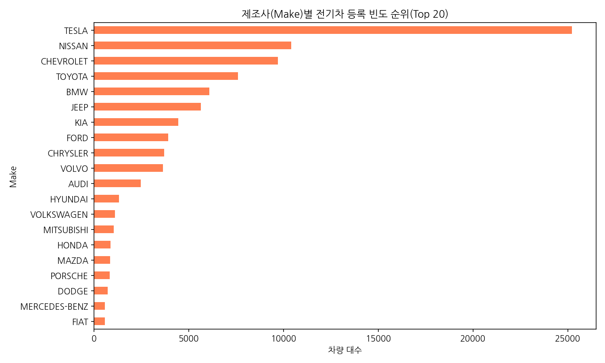

**관련 데이터 표**

| Make          |   count |
|:--------------|--------:|
| TESLA         |   25228 |
| NISSAN        |   10406 |
| CHEVROLET     |    9697 |
| TOYOTA        |    7585 |
| BMW           |    6075 |
| JEEP          |    5646 |
| KIA           |    4451 |
| FORD          |    3912 |
| CHRYSLER      |    3700 |
| VOLVO         |    3630 |
| AUDI          |    2465 |
| HYUNDAI       |    1309 |
| VOLKSWAGEN    |    1092 |
| MITSUBISHI    |    1041 |
| HONDA         |     869 |
| MAZDA         |     839 |
| PORSCHE       |     829 |
| DODGE         |     708 |
| MERCEDES-BENZ |     567 |
| FIAT          |     558 |

**분석 해석:**
본 가로 막대 그래프는 시장에 보급된 전기차의 상위 20개 제조사별 점유 현황을 나타냅니다. 테슬라와 같은 거대 메이저 브랜드의 독주 현상이 존재하는지 아니면 다양한 레거시 완성차 업체들이 시장 점유율을 나누어 가지고 있는지 파악할 수 있는 가장 대표적인 지표로 작용합니다.

## LA 충전 예측 및 날씨 데이터 (ev-charging-forecasting-with-weather-data-LA.csv)

### 1. 기본 정보 및 데이터 구조

- **데이터 크기**: 2,274행, 35열
- **중복 데이터 수**: 0개

**[데이터 Info]**
```
<class 'pandas.DataFrame'>
RangeIndex: 2274 entries, 0 to 2273
Data columns (total 35 columns):
 #   Column                           Non-Null Count  Dtype  
---  ------                           --------------  -----  
 0   Unnamed: 0                       2274 non-null   int64  
 1   _id                              2274 non-null   str    
 2   clusterID                        2274 non-null   int64  
 3   connectionTime                   2274 non-null   str    
 4   disconnectTime                   2274 non-null   str    
 5   doneChargingTime                 1939 non-null   str    
 6   kWhDelivered                     2274 non-null   float64
 7   sessionID                        2274 non-null   str    
 8   siteID                           2274 non-null   int64  
 9   spaceID                          2274 non-null   str    
 10  stationID                        2274 non-null   str    
 11  timezone                         2274 non-null   str    
 12  userID                           1839 non-null   float64
 13  userInputs/0/WhPerMile           1839 non-null   float64
 14  userInputs/0/kWhRequested        1839 non-null   float64
 15  userInputs/0/milesRequested      1839 non-null   float64
 16  userInputs/0/minutesAvailable    1839 non-null   float64
 17  userInputs/0/modifiedAt          1839 non-null   str    
 18  userInputs/0/paymentRequired     1839 non-null   object 
 19  userInputs/0/requestedDeparture  1839 non-null   str    
 20  userInputs/0/userID              1839 non-null   float64
 21  userInputs/1/WhPerMile           314 non-null    float64
 22  userInputs/1/kWhRequested        314 non-null    float64
 23  userInputs/1/milesRequested      314 non-null    float64
 24  userInputs/1/minutesAvailable    314 non-null    float64
 25  userInputs/1/modifiedAt          314 non-null    str    
 26  userInputs/1/paymentRequired     314 non-null    object 
 27  userInputs/1/requestedDeparture  314 non-null    str    
 28  userInputs/1/userID              314 non-null    float64
 29  chargingDurationHours            2274 non-null   float64
 30  chargingDuration                 2274 non-null   str    
 31  extraTimeConnected               1939 non-null   str    
 32  weather_conditions               2274 non-null   str    
 33  departure_hour                   2274 non-null   int64  
 34  departure_hour_range             2274 non-null   str    
dtypes: float64(13), int64(4), object(2), str(16)
memory usage: 1.2+ MB
```

**[상위 5개 행]**
|    |   Unnamed: 0 | _id                      |   clusterID | connectionTime      | disconnectTime      | doneChargingTime    |   kWhDelivered | sessionID                              |   siteID | spaceID   | stationID   | timezone            |   userID |   userInputs/0/WhPerMile |   userInputs/0/kWhRequested |   userInputs/0/milesRequested |   userInputs/0/minutesAvailable | userInputs/0/modifiedAt       | userInputs/0/paymentRequired   | userInputs/0/requestedDeparture   |   userInputs/0/userID |   userInputs/1/WhPerMile |   userInputs/1/kWhRequested |   userInputs/1/milesRequested |   userInputs/1/minutesAvailable |   userInputs/1/modifiedAt |   userInputs/1/paymentRequired |   userInputs/1/requestedDeparture |   userInputs/1/userID |   chargingDurationHours | chargingDuration   | extraTimeConnected   | weather_conditions                     |   departure_hour | departure_hour_range   |
|---:|-------------:|:-------------------------|------------:|:--------------------|:--------------------|:--------------------|---------------:|:---------------------------------------|---------:|:----------|:------------|:--------------------|---------:|-------------------------:|----------------------------:|------------------------------:|--------------------------------:|:------------------------------|:-------------------------------|:----------------------------------|----------------------:|-------------------------:|----------------------------:|------------------------------:|--------------------------------:|--------------------------:|-------------------------------:|----------------------------------:|----------------------:|------------------------:|:-------------------|:---------------------|:---------------------------------------|-----------------:|:-----------------------|
|  0 |            0 | 5e225f9ff9af8b5c26d21715 |          39 | 2020-01-01 09:42:14 | 2020-01-02 02:25:40 | 2020-01-01 14:42:11 |         32.02  | 2_39_131_30_2020-01-01 09:42:14.259248 |        2 | CA-305    | 2-39-131-30 | America/Los_Angeles |       67 |                      250 |                       60    |                           240 |                             720 | Wed, 01 Jan 2020 09:42:27 GMT | True                           | Wed, 01 Jan 2020 21:42:14 GMT     |                    67 |                      nan |                         nan |                           nan |                             nan |                       nan |                            nan |                               nan |                   nan |                16.7239  | 0 days 16:43:26    | 0 days 11:43:29      | Clouds generally forming or developing |                2 | 2-3                    |
|  1 |            1 | 5e225f9ff9af8b5c26d21716 |          39 | 2020-01-01 18:10:34 | 2020-01-01 21:05:40 | 2020-01-01 19:22:56 |          2.328 | 2_39_127_19_2020-01-01 18:10:34.057445 |        2 | CA-309    | 2-39-127-19 | America/Los_Angeles |      710 |                      261 |                        7.83 |                            30 |                             458 | Wed, 01 Jan 2020 18:10:53 GMT | True                           | Thu, 02 Jan 2020 01:48:34 GMT     |                   710 |                      nan |                         nan |                           nan |                             nan |                       nan |                            nan |                               nan |                   nan |                 2.91833 | 0 days 02:55:06    | 0 days 01:42:44      | State of sky on the whole unchanged    |               21 | 21-22                  |
|  2 |            2 | 5e225f9ff9af8b5c26d21717 |          39 | 2020-01-01 19:44:51 | 2020-01-02 01:23:37 | 2020-01-01 22:43:57 |         19.868 | 2_39_79_377_2020-01-01 19:44:51.127414 |        2 | CA-325    | 2-39-79-377 | America/Los_Angeles |      248 |                      250 |                       20    |                            80 |                             338 | Wed, 01 Jan 2020 19:46:01 GMT | True                           | Thu, 02 Jan 2020 01:22:51 GMT     |                   248 |                      nan |                         nan |                           nan |                             nan |                       nan |                            nan |                               nan |                   nan |                 5.64611 | 0 days 05:38:46    | 0 days 02:39:40      | Clouds generally forming or developing |                1 | 1-2                    |
|  3 |            3 | 5e225f9ff9af8b5c26d21718 |          39 | 2020-01-02 01:12:29 | 2020-01-02 04:38:39 | 2020-01-02 03:11:48 |          8.336 | 2_39_126_20_2020-01-02 01:12:28.778216 |        2 | CA-310    | 2-39-126-20 | America/Los_Angeles |     1099 |                      400 |                       24    |                            60 |                             125 | Thu, 02 Jan 2020 01:13:30 GMT | True                           | Thu, 02 Jan 2020 03:17:29 GMT     |                  1099 |                      nan |                         nan |                           nan |                             nan |                       nan |                            nan |                               nan |                   nan |                 3.43611 | 0 days 03:26:10    | 0 days 01:26:51      | Clouds generally forming or developing |                4 | 4-5                    |
|  4 |            4 | 5e225f9ff9af8b5c26d21719 |          39 | 2020-01-02 04:18:06 | 2020-01-03 00:06:13 | 2020-01-02 06:41:48 |         14.731 | 2_39_79_382_2020-01-02 04:18:06.407434 |        2 | CA-491    | 2-39-79-382 | America/Los_Angeles |     3267 |                      400 |                       40    |                           100 |                             583 | Thu, 02 Jan 2020 04:18:39 GMT | True                           | Thu, 02 Jan 2020 14:01:06 GMT     |                  3267 |                      nan |                         nan |                           nan |                             nan |                       nan |                            nan |                               nan |                   nan |                19.8019  | 0 days 19:48:07    | 0 days 17:24:25      | Drizzle, not freezing, continuous      |                0 | 0-1                    |

**[하위 5개 행]**
|      |   Unnamed: 0 | _id                      |   clusterID | connectionTime      | disconnectTime      | doneChargingTime    |   kWhDelivered | sessionID                               |   siteID | spaceID   | stationID    | timezone            |   userID |   userInputs/0/WhPerMile |   userInputs/0/kWhRequested |   userInputs/0/milesRequested |   userInputs/0/minutesAvailable | userInputs/0/modifiedAt       |   userInputs/0/paymentRequired | userInputs/0/requestedDeparture   |   userInputs/0/userID |   userInputs/1/WhPerMile |   userInputs/1/kWhRequested |   userInputs/1/milesRequested |   userInputs/1/minutesAvailable |   userInputs/1/modifiedAt |   userInputs/1/paymentRequired |   userInputs/1/requestedDeparture |   userInputs/1/userID |   chargingDurationHours | chargingDuration   | extraTimeConnected   | weather_conditions                     |   departure_hour | departure_hour_range   |
|-----:|-------------:|:-------------------------|------------:|:--------------------|:--------------------|:--------------------|---------------:|:----------------------------------------|---------:|:----------|:-------------|:--------------------|---------:|-------------------------:|----------------------------:|------------------------------:|--------------------------------:|:------------------------------|-------------------------------:|:----------------------------------|----------------------:|-------------------------:|----------------------------:|------------------------------:|--------------------------------:|--------------------------:|-------------------------------:|----------------------------------:|----------------------:|------------------------:|:-------------------|:---------------------|:---------------------------------------|-----------------:|:-----------------------|
| 2269 |         2269 | 5fdd57d3f9af8b16e6675e09 |          39 | 2020-11-30 18:33:34 | 2020-11-30 19:28:22 | nan                 |         20.981 | 2_39_81_4550_2020-11-30 18:33:33.964339 |        2 | 11900388  | 2-39-81-4550 | America/Los_Angeles |     7132 |                      274 |                        8.22 |                            30 |                             480 | Mon, 30 Nov 2020 18:33:51 GMT |                              1 | Tue, 01 Dec 2020 02:33:34 GMT     |                  7132 |                      nan |                         nan |                           nan |                             nan |                       nan |                            nan |                               nan |                   nan |                0.913333 | 0 days 00:54:48    | nan                  | Continuous fall of snowflakes          |               19 | 19-20                  |
| 2270 |         2270 | 5fdd57d3f9af8b16e6675e0a |          39 | 2020-11-30 22:33:25 | 2020-12-01 03:51:03 | 2020-11-30 23:40:16 |          2.239 | 2_39_78_365_2020-11-30 22:33:25.300548  |        2 | CA-321    | 2-39-78-365  | America/Los_Angeles |     1082 |                      290 |                        5.8  |                            20 |                             120 | Mon, 30 Nov 2020 22:34:36 GMT |                              1 | Tue, 01 Dec 2020 00:33:25 GMT     |                  1082 |                      nan |                         nan |                           nan |                             nan |                       nan |                            nan |                               nan |                   nan |                5.29389  | 0 days 05:17:38    | 0 days 04:10:47      | Clouds generally forming or developing |                3 | 3-4                    |
| 2271 |         2271 | 5fdd57d3f9af8b16e6675e0b |          39 | 2020-12-01 02:10:20 | 2020-12-01 02:49:04 | nan                 |         21.032 | 2_39_81_4550_2020-12-01 02:10:19.997513 |        2 | 11900388  | 2-39-81-4550 | America/Los_Angeles |     9266 |                      300 |                       48    |                           160 |                             461 | Tue, 01 Dec 2020 02:10:41 GMT |                              1 | Tue, 01 Dec 2020 09:51:20 GMT     |                  9266 |                      nan |                         nan |                           nan |                             nan |                       nan |                            nan |                               nan |                   nan |                0.645556 | 0 days 00:38:44    | nan                  | Clouds generally forming or developing |                2 | 2-3                    |
| 2272 |         2272 | 5fdd57d3f9af8b16e6675e0c |          39 | 2020-12-01 04:02:32 | 2020-12-01 04:17:36 | nan                 |          6.367 | 2_39_81_4550_2020-12-01 04:02:32.406901 |        2 | 11900388  | 2-39-81-4550 | America/Los_Angeles |     9625 |                      319 |                       28.71 |                            90 |                             259 | Tue, 01 Dec 2020 04:03:33 GMT |                              1 | Tue, 01 Dec 2020 08:21:32 GMT     |                  9625 |                      nan |                         nan |                           nan |                             nan |                       nan |                            nan |                               nan |                   nan |                0.251111 | 0 days 00:15:04    | nan                  | Clouds generally forming or developing |                4 | 4-5                    |
| 2273 |         2273 | 5fdd57d3f9af8b16e6675e0d |          39 | 2020-12-01 04:19:01 | 2020-12-01 04:54:25 | 2020-12-01 04:49:38 |          0.737 | 2_39_127_19_2020-12-01 04:19:01.008160  |        2 | CA-309    | 2-39-127-19  | America/Los_Angeles |      nan |                      nan |                      nan    |                           nan |                             nan | nan                           |                            nan | nan                               |                   nan |                      nan |                         nan |                           nan |                             nan |                       nan |                            nan |                               nan |                   nan |                0.59     | 0 days 00:35:24    | 0 days 00:04:47      | Clouds generally forming or developing |                4 | 4-5                    |

### 2. 기술 통계량

**[수치형 정보]**
|       |   Unnamed: 0 |   clusterID |   kWhDelivered |   siteID |   userID |   userInputs/0/WhPerMile |   userInputs/0/kWhRequested |   userInputs/0/milesRequested |   userInputs/0/minutesAvailable |   userInputs/0/userID |   userInputs/1/WhPerMile |   userInputs/1/kWhRequested |   userInputs/1/milesRequested |   userInputs/1/minutesAvailable |   userInputs/1/userID |   chargingDurationHours |   departure_hour |
|:------|-------------:|------------:|---------------:|---------:|---------:|-------------------------:|----------------------------:|------------------------------:|--------------------------------:|----------------------:|-------------------------:|----------------------------:|------------------------------:|--------------------------------:|----------------------:|------------------------:|-----------------:|
| count |     2274     |        2274 |     2274       |     2274 |  1839    |                1839      |                   1839      |                     1839      |                        1839     |               1839    |                  314     |                    314      |                      314      |                         314     |                314    |            2274         |       2274       |
| mean  |     1136.5   |          39 |        7.88457 |        2 |  1876.4  |                 371.517  |                     19.8749 |                       57.3056 |                         291.946 |               1876.4  |                  381.955 |                     21.9875 |                       61.4586 |                         293.847 |               2226.02 |               5.6265    |          8.281   |
| std   |      656.592 |           0 |        8.86064 |        0 |  1825.16 |                  81.4207 |                     16.0168 |                       49.7891 |                         183.819 |               1825.16 |                   82.662 |                     21.0528 |                       59.7734 |                         187.471 |               2207.87 |               4.72987   |          9.04633 |
| min   |        0     |          39 |        0.509   |        2 |    22    |                 200      |                      2.67   |                       10      |                          30     |                 22    |                  200     |                      2.67   |                       10      |                          44     |                 67    |               0.0886111 |          0       |
| 25%   |      568.25  |          39 |        1.8505  |        2 |   710    |                 325      |                      8      |                       20      |                         120     |                710    |                  325     |                      8      |                       20      |                         136     |                567    |               1.99118   |          1       |
| 50%   |     1136.5   |          39 |        5.152   |        2 |  1124    |                 400      |                     13.6    |                       40      |                         273     |               1124    |                  400     |                     13.5    |                       40      |                         263     |               1124    |               5.38139   |          3       |
| 75%   |     1704.75  |          39 |       10.846   |        2 |  2170    |                 400      |                     28      |                       80      |                         441     |               2170    |                  400     |                     29.2    |                       80      |                         435.5   |               3442.75 |               8.21146   |         19       |
| max   |     2273     |          39 |       53.925   |        2 |  9625    |                2000      |                    200      |                      300      |                         911     |               9625    |                  600     |                    107.04   |                      240      |                        1133     |               9502    |              76.9306    |         23       |

**[범주형 정보]**
|        | _id                      | connectionTime      | disconnectTime      | doneChargingTime    | sessionID                              | spaceID   | stationID   | timezone            | userInputs/0/modifiedAt       |   userInputs/0/paymentRequired | userInputs/0/requestedDeparture   | userInputs/1/modifiedAt       |   userInputs/1/paymentRequired | userInputs/1/requestedDeparture   | chargingDuration   | extraTimeConnected   | weather_conditions                | departure_hour_range   |
|:-------|:-------------------------|:--------------------|:--------------------|:--------------------|:---------------------------------------|:----------|:------------|:--------------------|:------------------------------|-------------------------------:|:----------------------------------|:------------------------------|-------------------------------:|:----------------------------------|:-------------------|:---------------------|:----------------------------------|:-----------------------|
| count  | 2274                     | 2274                | 2274                | 1939                | 2274                                   | 2274      | 2274        | 2274                | 1839                          |                           1839 | 1839                              | 314                           |                            314 | 314                               | 2274               | 1939                 | 2274                              | 2274                   |
| unique | 2274                     | 2272                | 2272                | 1911                | 2274                                   | 50        | 50          | 1                   | 1838                          |                              1 | 1839                              | 314                           |                              1 | 314                               | 2168               | 1498                 | 7                                 | 23                     |
| top    | 5e225f9ff9af8b5c26d21715 | 2020-03-09 15:09:22 | 2020-02-26 00:21:50 | 2020-03-11 00:49:01 | 2_39_131_30_2020-01-01 09:42:14.259248 | CA-303    | 2-39-139-28 | America/Los_Angeles | Tue, 18 Feb 2020 18:56:08 GMT |                           True | Wed, 01 Jan 2020 21:42:14 GMT     | Thu, 02 Jan 2020 17:48:27 GMT |                           True | Fri, 03 Jan 2020 01:25:53 GMT     | 0 days 02:55:06    | 0 days 00:00:05      | Drizzle, not freezing, continuous | 1-2                    |
| freq   | 1                        | 2                   | 2                   | 7                   | 1                                      | 147       | 147         | 2274                | 2                             |                           1839 | 1                                 | 1                             |                            314 | 1                                 | 3                  | 142                  | 1104                              | 473                    |

### 3. 세부 특성 및 시각화 분석

#### 시각화 4: 충전 중의 날씨 상황(Weather Conditions) 빈도

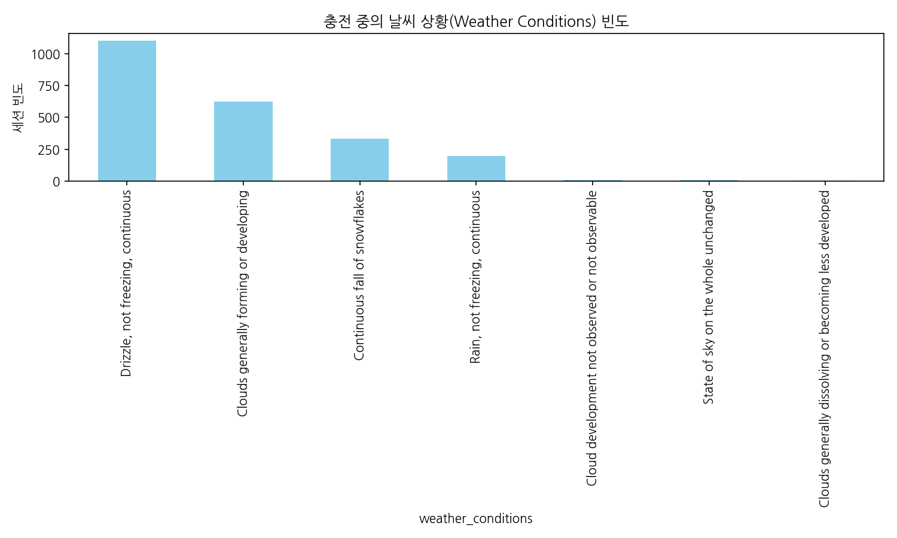

**관련 데이터 표**

| weather_conditions                                     |   count |
|:-------------------------------------------------------|--------:|
| Drizzle, not freezing, continuous                      |    1104 |
| Clouds generally forming or developing                 |     626 |
| Continuous fall of snowflakes                          |     331 |
| Rain, not freezing, continuous                         |     197 |
| Cloud development not observed or not observable       |       7 |
| State of sky on the whole unchanged                    |       6 |
| Clouds generally dissolving or becoming less developed |       3 |

**분석 해석:**
충전을 예측하는 당시에 기록된 다양한 날씨 상황(흐림, 맑음, 비 등)에 대한 빈도 그래프입니다. LA 지역 기반 데이터 구조상 맑은 날 비율이 월등히 높을 것으로 추정되며, 특정 비나 눈 등 악천후 상황에서 충전 행태가 줄어들거나 급증하는지를 후속 모델링으로 연결하기 위한 예비 분석입니다.

### 4. 텍스트 컬럼 주요 키워드 분석

#### 시각화 5: 'sessionID' 컬럼의 상위 키워드 TF-IDF 중요도

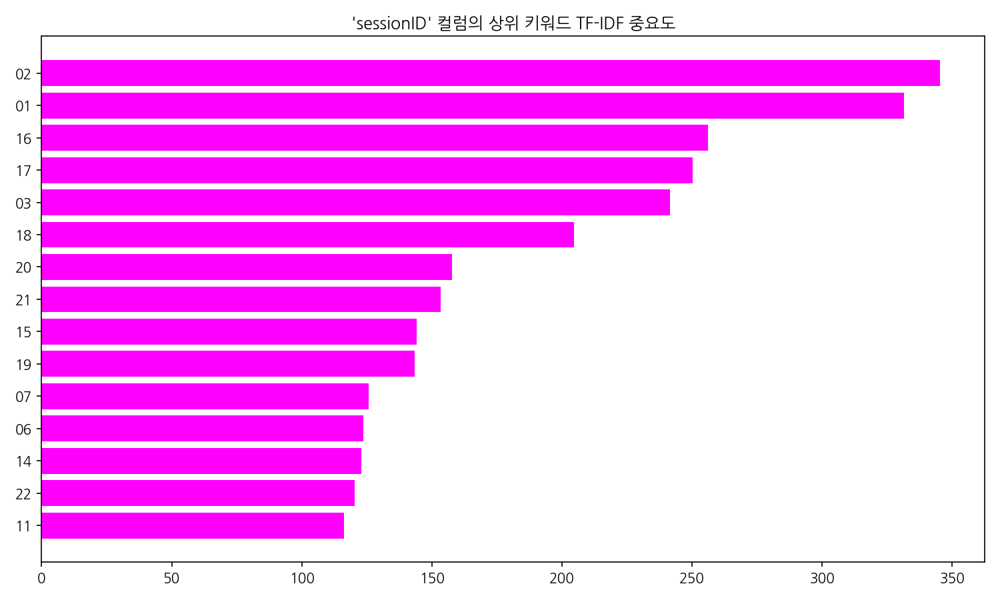

**키워드 빈도 표**

|          Keyword |   TF-IDF Score |
|-----------------:|---------------:|
|               02 |       345.298  |
|               01 |       331.421  |
|               16 |       256.002  |
|               17 |       250.303  |
|               03 |       241.607  |
|               18 |       204.693  |
|               20 |       157.811  |
|               21 |       153.47   |
|               15 |       144.062  |
|               19 |       143.253  |
|               07 |       125.606  |
|               06 |       123.528  |
|               14 |       122.963  |
|               22 |       120.378  |
|               11 |       116.184  |
|               04 |       115.407  |
|               13 |       109.074  |
|               05 |       108.857  |
|               23 |       108.604  |
|               09 |       103.147  |
|               10 |       102.897  |
|               12 |        96.0654 |
|               28 |        92.6287 |
|               27 |        91.9022 |
|               24 |        91.0635 |
|               08 |        88.3317 |
|               29 |        84.6351 |
|               00 |        83.4761 |
|               26 |        81.2481 |
| 2_39_139_28_2020 |        78.0259 |

**분석 해석:**
평균 글자 수 및 고유값이 큰 문자열로 식별된 컬럼에 대하여, 자연어 전처리를 기반으로 한 빈도-역문서 빈도(TF-IDF) 알고리즘을 사용해 가장 특색 있는 핵심 단어를 추출했습니다. 무의미한 불용어를 거르고 도출된 이 결과는 고객의 리뷰 내용이나 운영 세부 데이터에서의 이슈를 파악하는 정성적 지표로 탁월한 통찰들을 제공합니다.

## 워싱턴 주 전기차 등록 인구 데이터 (Electric_Vehicle_Population_Data.csv)

### 1. 기본 정보 및 데이터 구조

- **데이터 크기**: 150,482행, 17열
- **중복 데이터 수**: 0개

**[데이터 Info]**
```
<class 'pandas.DataFrame'>
RangeIndex: 150482 entries, 0 to 150481
Data columns (total 17 columns):
 #   Column                                             Non-Null Count   Dtype  
---  ------                                             --------------   -----  
 0   VIN (1-10)                                         150482 non-null  str    
 1   County                                             150479 non-null  str    
 2   City                                               150479 non-null  str    
 3   State                                              150482 non-null  str    
 4   Postal Code                                        150479 non-null  float64
 5   Model Year                                         150482 non-null  int64  
 6   Make                                               150482 non-null  str    
 7   Model                                              150482 non-null  str    
 8   Electric Vehicle Type                              150482 non-null  str    
 9   Clean Alternative Fuel Vehicle (CAFV) Eligibility  150482 non-null  str    
 10  Electric Range                                     150482 non-null  int64  
 11  Base MSRP                                          150482 non-null  int64  
 12  Legislative District                               150141 non-null  float64
 13  DOL Vehicle ID                                     150482 non-null  int64  
 14  Vehicle Location                                   150475 non-null  str    
 15  Electric Utility                                   150479 non-null  str    
 16  2020 Census Tract                                  150479 non-null  float64
dtypes: float64(3), int64(4), str(10)
memory usage: 47.0 MB
```

**[상위 5개 행]**
|    | VIN (1-10)   | County   | City     | State   |   Postal Code |   Model Year | Make    | Model          | Electric Vehicle Type                  | Clean Alternative Fuel Vehicle (CAFV) Eligibility   |   Electric Range |   Base MSRP |   Legislative District |   DOL Vehicle ID | Vehicle Location                | Electric Utility                              |   2020 Census Tract |
|---:|:-------------|:---------|:---------|:--------|--------------:|-------------:|:--------|:---------------|:---------------------------------------|:----------------------------------------------------|-----------------:|------------:|-----------------------:|-----------------:|:--------------------------------|:----------------------------------------------|--------------------:|
|  0 | KM8K33AGXL   | King     | Seattle  | WA      |         98103 |         2020 | HYUNDAI | KONA           | Battery Electric Vehicle (BEV)         | Clean Alternative Fuel Vehicle Eligible             |              258 |           0 |                     43 |        249675142 | POINT (-122.34301 47.659185)    | CITY OF SEATTLE - (WA)|CITY OF TACOMA - (WA)  |          5.3033e+10 |
|  1 | 1C4RJYB61N   | King     | Bothell  | WA      |         98011 |         2022 | JEEP    | GRAND CHEROKEE | Plug-in Hybrid Electric Vehicle (PHEV) | Not eligible due to low battery range               |               25 |           0 |                      1 |        233928502 | POINT (-122.20578 47.762405)    | PUGET SOUND ENERGY INC||CITY OF TACOMA - (WA) |          5.3033e+10 |
|  2 | 1C4RJYD61P   | Yakima   | Yakima   | WA      |         98908 |         2023 | JEEP    | GRAND CHEROKEE | Plug-in Hybrid Electric Vehicle (PHEV) | Not eligible due to low battery range               |               25 |           0 |                     14 |        229675939 | POINT (-120.6027202 46.5965625) | PACIFICORP                                    |          5.3077e+10 |
|  3 | 5YJ3E1EA7J   | King     | Kirkland | WA      |         98034 |         2018 | TESLA   | MODEL 3        | Battery Electric Vehicle (BEV)         | Clean Alternative Fuel Vehicle Eligible             |              215 |           0 |                     45 |        104714466 | POINT (-122.209285 47.71124)    | PUGET SOUND ENERGY INC||CITY OF TACOMA - (WA) |          5.3033e+10 |
|  4 | WBY7Z8C5XJ   | Thurston | Olympia  | WA      |         98501 |         2018 | BMW     | I3             | Plug-in Hybrid Electric Vehicle (PHEV) | Clean Alternative Fuel Vehicle Eligible             |               97 |           0 |                     22 |        185498386 | POINT (-122.89692 47.043535)    | PUGET SOUND ENERGY INC                        |          5.3067e+10 |

**[하위 5개 행]**
|        | VIN (1-10)   | County       | City              | State   |   Postal Code |   Model Year | Make   | Model   | Electric Vehicle Type                  | Clean Alternative Fuel Vehicle (CAFV) Eligibility            |   Electric Range |   Base MSRP |   Legislative District |   DOL Vehicle ID | Vehicle Location             | Electric Utility                                                 |   2020 Census Tract |
|-------:|:-------------|:-------------|:------------------|:--------|--------------:|-------------:|:-------|:--------|:---------------------------------------|:-------------------------------------------------------------|-----------------:|------------:|-----------------------:|-----------------:|:-----------------------------|:-----------------------------------------------------------------|--------------------:|
| 150477 | WBY43AW05P   | Grays Harbor | Montesano         | WA      |         98563 |         2023 | BMW    | I4      | Battery Electric Vehicle (BEV)         | Eligibility unknown as battery range has not been researched |                0 |           0 |                     19 |        251204075 | POINT (-123.60535 46.982215) | BONNEVILLE POWER ADMINISTRATION||PUD NO 1 OF GRAYS HARBOR COUNTY |         5.3027e+10  |
| 150478 | 5YJ3E1EB7P   | King         | Seattle           | WA      |         98104 |         2023 | TESLA  | MODEL 3 | Battery Electric Vehicle (BEV)         | Eligibility unknown as battery range has not been researched |                0 |           0 |                     43 |        241344414 | POINT (-122.329075 47.6018)  | CITY OF SEATTLE - (WA)|CITY OF TACOMA - (WA)                     |         5.3033e+10  |
| 150479 | 5YJYGDEEXM   | King         | Seattle           | WA      |         98109 |         2021 | TESLA  | MODEL Y | Battery Electric Vehicle (BEV)         | Eligibility unknown as battery range has not been researched |                0 |           0 |                     43 |        180705626 | POINT (-122.34848 47.632405) | CITY OF SEATTLE - (WA)|CITY OF TACOMA - (WA)                     |         5.3033e+10  |
| 150480 | 5UXTA6C08P   | Snohomish    | Mountlake Terrace | WA      |         98043 |         2023 | BMW    | X5      | Plug-in Hybrid Electric Vehicle (PHEV) | Clean Alternative Fuel Vehicle Eligible                      |               30 |           0 |                      1 |        240473950 | POINT (-122.30842 47.78416)  | PUGET SOUND ENERGY INC                                           |         5.30611e+10 |
| 150481 | 7SAYGDEF8N   | Skagit       | Mount Vernon      | WA      |         98273 |         2022 | TESLA  | MODEL Y | Battery Electric Vehicle (BEV)         | Eligibility unknown as battery range has not been researched |                0 |           0 |                     40 |        207667589 | POINT (-122.338975 48.41333) | PUGET SOUND ENERGY INC                                           |         5.3058e+10  |

### 2. 기술 통계량

**[수치형 정보]**
|       |   Postal Code |   Model Year |   Electric Range |   Base MSRP |   Legislative District |   DOL Vehicle ID |   2020 Census Tract |
|:------|--------------:|-------------:|-----------------:|------------:|-----------------------:|-----------------:|--------------------:|
| count |     150479    | 150482       |      150482      |   150482    |            150141      | 150482           |    150479           |
| mean  |      98168.3  |   2020.01    |          67.8778 |     1312.64 |                29.344  |      2.11112e+08 |         5.2972e+10  |
| std   |       2473.61 |      3.01521 |          96.23   |     9231.31 |                14.8248 |      8.19639e+07 |         1.63884e+09 |
| min   |       1730    |   1997       |           0      |        0    |                 1      |   4385           |         1.08104e+09 |
| 25%   |      98052    |   2018       |           0      |        0    |                18      |      1.69347e+08 |         5.3033e+10  |
| 50%   |      98122    |   2021       |          18      |        0    |                33      |      2.15031e+08 |         5.3033e+10  |
| 75%   |      98370    |   2023       |          97      |        0    |                43      |      2.39912e+08 |         5.30531e+10 |
| max   |      99577    |   2024       |         337      |   845000    |                49      |      4.79255e+08 |         5.6033e+10  |

**[범주형 정보]**
|        | VIN (1-10)   | County   | City    | State   | Make   | Model   | Electric Vehicle Type          | Clean Alternative Fuel Vehicle (CAFV) Eligibility            | Vehicle Location            | Electric Utility                              |
|:-------|:-------------|:---------|:--------|:--------|:-------|:--------|:-------------------------------|:-------------------------------------------------------------|:----------------------------|:----------------------------------------------|
| count  | 150482       | 150479   | 150479  | 150482  | 150482 | 150482  | 150482                         | 150482                                                       | 150475                      | 150479                                        |
| unique | 9529         | 183      | 683     | 41      | 37     | 127     | 2                              | 3                                                            | 822                         | 76                                            |
| top    | 7SAYGDEE7P   | King     | Seattle | WA      | TESLA  | MODEL Y | Battery Electric Vehicle (BEV) | Eligibility unknown as battery range has not been researched | POINT (-122.12302 47.67668) | PUGET SOUND ENERGY INC||CITY OF TACOMA - (WA) |
| freq   | 807          | 79075    | 25675   | 150141  | 68983  | 28502   | 116807                         | 69698                                                        | 3869                        | 55634                                         |

### 3. 세부 특성 및 시각화 분석

#### 시각화 6: 행정 구역(County)별 전기차 인구 분포 Top 15

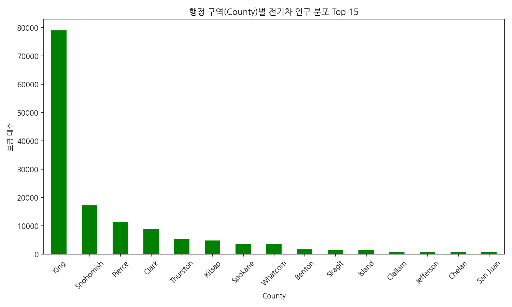

**관련 데이터 표**

| County    |   count |
|:----------|--------:|
| King      |   79075 |
| Snohomish |   17307 |
| Pierce    |   11542 |
| Clark     |    8855 |
| Thurston  |    5403 |
| Kitsap    |    4923 |
| Spokane   |    3690 |
| Whatcom   |    3668 |
| Benton    |    1801 |
| Skagit    |    1658 |
| Island    |    1640 |
| Clallam   |     920 |
| Jefferson |     878 |
| Chelan    |     863 |
| San Juan  |     844 |

**분석 해석:**
미국 워싱턴주 등 주 단위의 포괄적인 데이터에서 가장 전기차가 밀집해있는 하위 행정 구역 리스트 15개입니다. King County와 같이 기술 인프라가 높고 친환경 정책이 강한 대도심 쪽에 집중되어있는 현상을 시각적으로 입증하며 지방으로 갈수록 보급이 감소하는 경향을 보여줍니다.

#### 시각화 7: 주요 핵심 브랜드별 차량의 전기 주행거리 분포

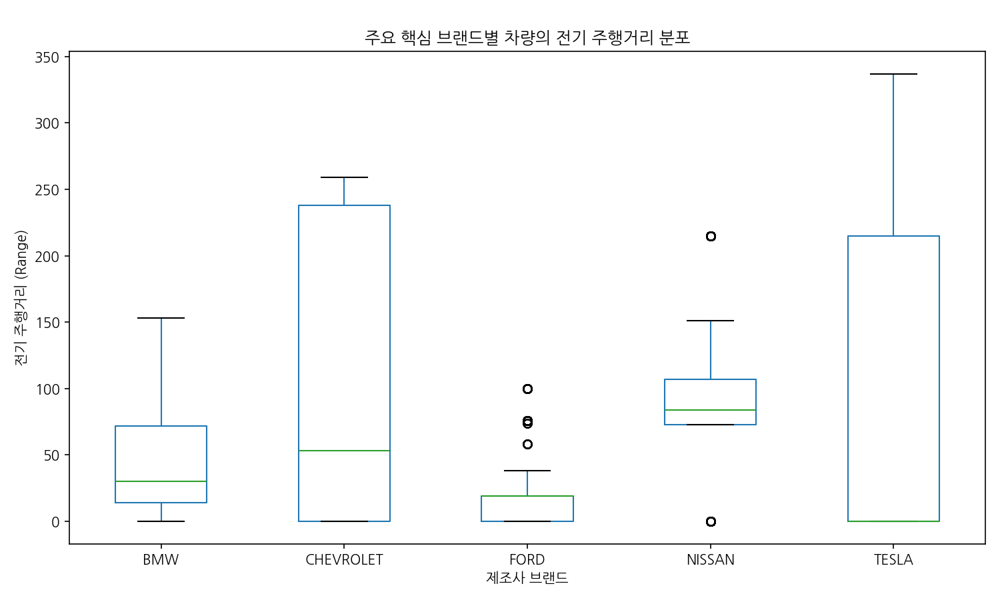

**관련 통계 표 (그룹별 Description)**

| Make      |   count |    mean |      std |   min |   25% |   50% |   75% |   max |
|:----------|--------:|--------:|---------:|------:|------:|------:|------:|------:|
| BMW       |    6439 | 38.1634 |  37.2446 |     0 |    14 |    30 |    72 |   153 |
| CHEVROLET |   12026 | 95.2677 | 101.247  |     0 |     0 |    53 |   238 |   259 |
| FORD      |    7614 | 13.0239 |  16.5302 |     0 |     0 |    19 |    19 |   100 |
| NISSAN    |   13497 | 84.7249 |  51.4065 |     0 |    73 |    84 |   107 |   215 |
| TESLA     |   68983 | 90.2969 | 118.906  |     0 |     0 |     0 |   215 |   337 |

**분석 해석:**
상위 5개의 핵심 전기차 브랜드를 추출하여 배터리 효율의 척도인 주행 거리(Range)를 박스 플롯으로 나타냈습니다. 데이터에 집적된 구형 및 신형 모델 편차가 포함되어 박스 모양에 분산이 크게 보이지만 제조사별로 핵심 역량인 배터리 밀도를 간접적으로 엿볼 수 있으며 중앙값 레벨의 격차를 보여주는 유용한 그래프입니다.

### 4. 텍스트 컬럼 주요 키워드 분석

#### 시각화 8: 'Electric Utility' 컬럼의 상위 키워드 TF-IDF 중요도

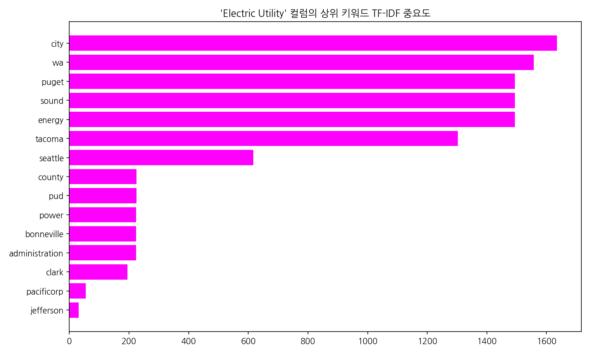

**키워드 빈도 표**

| Keyword        |   TF-IDF Score |
|:---------------|---------------:|
| city           |     1634.39    |
| wa             |     1557.48    |
| puget          |     1493.64    |
| sound          |     1493.64    |
| energy         |     1493.64    |
| tacoma         |     1303.05    |
| seattle        |      616.153   |
| county         |      224.785   |
| pud            |      224.785   |
| power          |      223.265   |
| bonneville     |      223.072   |
| administration |      223.072   |
| clark          |      194.672   |
| pacificorp     |       54.6609  |
| jefferson      |       30.7369  |
| cowlitz        |       28.8176  |
| electric       |        7.39467 |
| company        |        7.09554 |
| light          |        5.65413 |
| peninsula      |        5.28754 |
| avista         |        4.69871 |
| corp           |        4.69871 |
| chelan         |        4.32821 |
| service        |        4.0691  |
| utility        |        4.0691  |
| known          |        4.0691  |
| snohomish      |        3.69308 |
| clallam        |        2.26649 |
| benton         |        1.99611 |
| water          |        1.93543 |

**분석 해석:**
평균 글자 수 및 고유값이 큰 문자열로 식별된 컬럼에 대하여, 자연어 전처리를 기반으로 한 빈도-역문서 빈도(TF-IDF) 알고리즘을 사용해 가장 특색 있는 핵심 단어를 추출했습니다. 무의미한 불용어를 거르고 도출된 이 결과는 고객의 리뷰 내용이나 운영 세부 데이터에서의 이슈를 파악하는 정성적 지표로 탁월한 통찰들을 제공합니다.

## Caltech ACN 충전 세션 데이터 (caltech_acn_data_2018_2020.csv)

### 1. 기본 정보 및 데이터 구조

- **데이터 크기**: 57,498행, 13열
- **중복 데이터 수**: 0개

**[데이터 Info]**
```
<class 'pandas.DataFrame'>
RangeIndex: 57498 entries, 0 to 57497
Data columns (total 13 columns):
 #   Column            Non-Null Count  Dtype  
---  ------            --------------  -----  
 0   _id               57498 non-null  str    
 1   userInputs        39640 non-null  str    
 2   sessionID         57498 non-null  str    
 3   stationID         57498 non-null  str    
 4   spaceID           57498 non-null  str    
 5   siteID            57498 non-null  int64  
 6   clusterID         57498 non-null  int64  
 7   connectionTime    57498 non-null  str    
 8   disconnectTime    57498 non-null  str    
 9   kWhDelivered      57498 non-null  float64
 10  doneChargingTime  54833 non-null  str    
 11  timezone          57498 non-null  str    
 12  userID            39640 non-null  float64
dtypes: float64(2), int64(2), str(9)
memory usage: 26.7 MB
```

**[상위 5개 행]**
|    | _id                      |   userInputs | sessionID                              | stationID   | spaceID   |   siteID |   clusterID | connectionTime            | disconnectTime            |   kWhDelivered | doneChargingTime          | timezone            |   userID |
|---:|:-------------------------|-------------:|:---------------------------------------|:------------|:----------|---------:|------------:|:--------------------------|:--------------------------|---------------:|:--------------------------|:--------------------|---------:|
|  0 | 5bc90cb9f9af8b0d7fe77cd2 |          nan | 2_39_78_362_2018-04-25 11:08:04.400812 | 2-39-78-362 | CA-496    |        2 |          39 | 2018-04-25 04:08:04-07:00 | 2018-04-25 06:20:10-07:00 |          7.932 | 2018-04-25 06:21:10-07:00 | America/Los_Angeles |      nan |
|  1 | 5bc90cb9f9af8b0d7fe77cd3 |          nan | 2_39_95_27_2018-04-25 13:45:09.617470  | 2-39-95-27  | CA-319    |        2 |          39 | 2018-04-25 06:45:10-07:00 | 2018-04-25 17:56:16-07:00 |         10.013 | 2018-04-25 09:44:15-07:00 | America/Los_Angeles |      nan |
|  2 | 5bc90cb9f9af8b0d7fe77cd4 |          nan | 2_39_79_380_2018-04-25 13:45:49.962001 | 2-39-79-380 | CA-489    |        2 |          39 | 2018-04-25 06:45:50-07:00 | 2018-04-25 16:04:45-07:00 |          5.257 | 2018-04-25 07:51:44-07:00 | America/Los_Angeles |      nan |
|  3 | 5bc90cb9f9af8b0d7fe77cd5 |          nan | 2_39_79_379_2018-04-25 14:37:06.460772 | 2-39-79-379 | CA-327    |        2 |          39 | 2018-04-25 07:37:06-07:00 | 2018-04-25 16:55:34-07:00 |          5.177 | 2018-04-25 09:05:22-07:00 | America/Los_Angeles |      nan |
|  4 | 5bc90cb9f9af8b0d7fe77cd6 |          nan | 2_39_79_381_2018-04-25 14:40:33.638896 | 2-39-79-381 | CA-490    |        2 |          39 | 2018-04-25 07:40:34-07:00 | 2018-04-25 16:03:12-07:00 |         10.119 | 2018-04-25 10:40:30-07:00 | America/Los_Angeles |      nan |

**[하위 5개 행]**
|       | _id                      | userInputs                                                                                                                                                                                                                                  | sessionID                                  | stationID       |   spaceID |   siteID |   clusterID | connectionTime            | disconnectTime            |   kWhDelivered | doneChargingTime          | timezone            |   userID |
|------:|:-------------------------|:--------------------------------------------------------------------------------------------------------------------------------------------------------------------------------------------------------------------------------------------|:-------------------------------------------|:----------------|----------:|---------:|------------:|:--------------------------|:--------------------------|---------------:|:--------------------------|:--------------------|---------:|
| 57493 | 5ff9071df9af8b41eda5940c | [{'userID': 6140, 'milesRequested': 280, 'WhPerMile': 258, 'minutesAvailable': 1385, 'modifiedAt': 'Wed, 23 Dec 2020 23:10:45 GMT', 'paymentRequired': True, 'requestedDeparture': 'Thu, 24 Dec 2020 22:15:46 GMT', 'kWhRequested': 72.24}] | 19_102_260_1640_2020-12-23 23:10:34.498759 | 19-102-260-1640 |        08 |       19 |         102 | 2020-12-23 15:10:46-08:00 | 2020-12-24 16:11:38-08:00 |         53.688 | 2020-12-24 15:38:39-08:00 | America/Los_Angeles |     6140 |
| 57494 | 5ffcfb9cf9af8b4820a1fae3 | [{'userID': 6140, 'milesRequested': 280, 'WhPerMile': 258, 'minutesAvailable': 1385, 'modifiedAt': 'Sun, 27 Dec 2020 01:54:16 GMT', 'paymentRequired': True, 'requestedDeparture': 'Mon, 28 Dec 2020 00:59:09 GMT', 'kWhRequested': 72.24}] | 19_102_260_1640_2020-12-27 01:54:08.502499 | 19-102-260-1640 |        08 |       19 |         102 | 2020-12-26 17:54:09-08:00 | 2020-12-26 20:11:19-08:00 |          3.734 | 2020-12-26 20:10:55-08:00 | America/Los_Angeles |     6140 |
| 57495 | 5fff9e9bf9af8b4c287cf915 | [{'userID': 6620, 'milesRequested': 80, 'WhPerMile': 1428, 'minutesAvailable': 360, 'modifiedAt': 'Mon, 28 Dec 2020 21:44:42 GMT', 'paymentRequired': True, 'requestedDeparture': 'Tue, 29 Dec 2020 03:44:12 GMT', 'kWhRequested': 114.24}] | 19_102_260_1639_2020-12-28 21:44:12.413815 | 19-102-260-1639 |        05 |       19 |         102 | 2020-12-28 13:44:12-08:00 | 2020-12-28 17:34:18-08:00 |         12.685 | 2020-12-28 17:34:02-08:00 | America/Los_Angeles |     6620 |
| 57496 | 6000f01af9af8b4e280b67de | [{'userID': 6620, 'milesRequested': 80, 'WhPerMile': 1428, 'minutesAvailable': 360, 'modifiedAt': 'Tue, 29 Dec 2020 18:52:47 GMT', 'paymentRequired': True, 'requestedDeparture': 'Wed, 30 Dec 2020 00:52:33 GMT', 'kWhRequested': 114.24}] | 19_102_260_1639_2020-12-29 18:52:32.555547 | 19-102-260-1639 |        05 |       19 |         102 | 2020-12-29 10:52:33-08:00 | 2020-12-29 17:03:42-08:00 |         25.214 | 2020-12-29 17:03:29-08:00 | America/Los_Angeles |     6620 |
| 57497 | 6002419bf9af8b504f8b35a7 | [{'userID': 6620, 'milesRequested': 80, 'WhPerMile': 1428, 'minutesAvailable': 360, 'modifiedAt': 'Wed, 30 Dec 2020 20:25:14 GMT', 'paymentRequired': True, 'requestedDeparture': 'Thu, 31 Dec 2020 02:25:06 GMT', 'kWhRequested': 114.24}] | 19_102_260_1634_2020-12-30 20:25:06.391467 | 19-102-260-1634 |        03 |       19 |         102 | 2020-12-30 12:25:06-08:00 | 2020-12-30 17:52:11-08:00 |         19.556 | 2020-12-30 17:51:55-08:00 | America/Los_Angeles |     6620 |

### 2. 기술 통계량

**[수치형 정보]**
|       |      siteID |   clusterID |   kWhDelivered |   userID |
|:------|------------:|------------:|---------------:|---------:|
| count | 57498       |  57498      |     57498      | 39640    |
| mean  |     1.9184  |     22.1398 |        11.6447 |  1230.05 |
| std   |     2.70128 |     22.5078 |        10.1876 |  1303.61 |
| min   |     1       |      1      |         0.501  |     1    |
| 25%   |     1       |      1      |         4.982  |   420    |
| 50%   |     2       |     39      |         9.043  |   714    |
| 75%   |     2       |     39      |        14.0388 |  1471    |
| max   |    19       |    102      |        75.528  | 10090    |

**[범주형 정보]**
|        | _id                      | userInputs                                                                                                                                                                                                                              | sessionID                              | stationID   | spaceID   | connectionTime            | disconnectTime            | doneChargingTime          | timezone            |
|:-------|:-------------------------|:----------------------------------------------------------------------------------------------------------------------------------------------------------------------------------------------------------------------------------------|:---------------------------------------|:------------|:----------|:--------------------------|:--------------------------|:--------------------------|:--------------------|
| count  | 57498                    | 39640                                                                                                                                                                                                                                   | 57498                                  | 57498       | 57498     | 57498                     | 57498                     | 54833                     | 57498               |
| unique | 57498                    | 39640                                                                                                                                                                                                                                   | 57498                                  | 115         | 115       | 57310                     | 57387                     | 54562                     | 1                   |
| top    | 5bc90cb9f9af8b0d7fe77cd2 | [{'userID': 22, 'milesRequested': 170, 'WhPerMile': 350, 'minutesAvailable': 550, 'modifiedAt': 'Mon, 30 Apr 2018 15:08:54 GMT', 'paymentRequired': True, 'requestedDeparture': 'Tue, 01 May 2018 00:17:49 GMT', 'kWhRequested': 59.5}] | 2_39_78_362_2018-04-25 11:08:04.400812 | 2-39-139-28 | CA-303    | 2018-08-28 08:54:35-07:00 | 2018-08-07 19:32:45-07:00 | 2018-10-16 09:40:56-07:00 | America/Los_Angeles |
| freq   | 1                        | 1                                                                                                                                                                                                                                       | 1                                      | 1528        | 1528      | 8                         | 5                         | 8                         | 57498               |

### 3. 세부 특성 및 시각화 분석

#### 시각화 9: 충전 사이트(Site ID)별 총 지급된 역대 에너지(kWh)

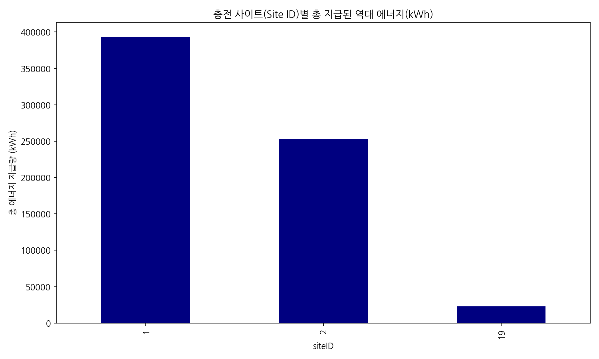

**관련 데이터 표**

|   siteID |   kWhDelivered |
|---------:|---------------:|
|        1 |       393655   |
|        2 |       253090   |
|       19 |        22803.2 |

**분석 해석:**
캘리포니아 공대 ACN 네트워크 안에 구성된 다수의 주차장 및 충전 섹터(사이트) 중 에너지를 가장 압도적으로 많이 소비한 영역을 보여줍니다. 이는 주간 이용자 통행량이 가장 많거나 장시간 체류하는 주차 허브임을 암시하며 에너지 그리드 매니지먼트에서 최우선 관리대상으로 지정할 수 있는 근거를 제공합니다.

### 4. 텍스트 컬럼 주요 키워드 분석

#### 시각화 10: 'userInputs' 컬럼의 상위 키워드 TF-IDF 중요도

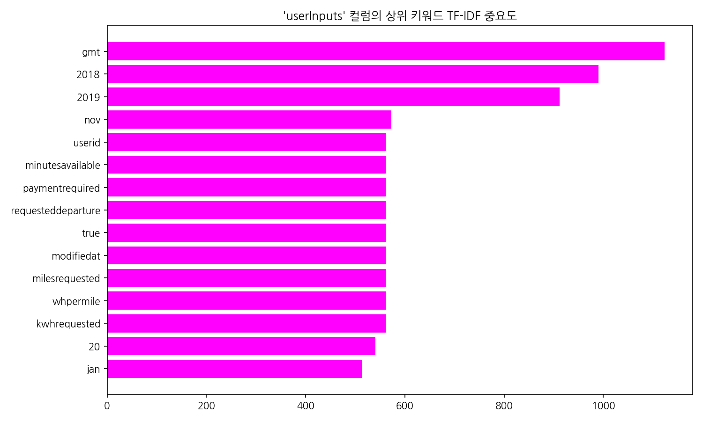

**키워드 빈도 표**

| Keyword            |   TF-IDF Score |
|:-------------------|---------------:|
| gmt                |       1123.27  |
| 2018               |        989.635 |
| 2019               |        911.254 |
| nov                |        572.887 |
| userid             |        561.636 |
| minutesavailable   |        561.636 |
| paymentrequired    |        561.636 |
| requesteddeparture |        561.636 |
| true               |        561.636 |
| modifiedat         |        561.636 |
| milesrequested     |        561.636 |
| whpermile          |        561.636 |
| kwhrequested       |        561.636 |
| 20                 |        540.141 |
| jan                |        512.836 |
| mar                |        502.152 |
| feb                |        484.387 |
| tue                |        472.444 |
| wed                |        472.349 |
| dec                |        467.532 |
| thu                |        458.862 |
| fri                |        451.059 |
| 16                 |        438.98  |
| 15                 |        403.64  |
| mon                |        393.625 |
| 01                 |        372.597 |
| 17                 |        371.289 |
| 400                |        366.369 |
| 21                 |        361.451 |
| 18                 |        357.924 |

**분석 해석:**
평균 글자 수 및 고유값이 큰 문자열로 식별된 컬럼에 대하여, 자연어 전처리를 기반으로 한 빈도-역문서 빈도(TF-IDF) 알고리즘을 사용해 가장 특색 있는 핵심 단어를 추출했습니다. 무의미한 불용어를 거르고 도출된 이 결과는 고객의 리뷰 내용이나 운영 세부 데이터에서의 이슈를 파악하는 정성적 지표로 탁월한 통찰들을 제공합니다.

## 충전소 사용 이력 대용량 데이터 (EVChargingStationUsage.csv)

*알림: 데이터가 매우 방대하여 무작위는 아니지만 상위 50만 행만 샘플링하여 처리했습니다.*

### 1. 기본 정보 및 데이터 구조

- **데이터 크기**: 259,415행, 33열
- **중복 데이터 수**: 4개

**[데이터 Info]**
```
<class 'pandas.DataFrame'>
RangeIndex: 259415 entries, 0 to 259414
Data columns (total 33 columns):
 #   Column                           Non-Null Count   Dtype  
---  ------                           --------------   -----  
 0   Station Name                     259415 non-null  str    
 1   MAC Address                      259415 non-null  str    
 2   Org Name                         259415 non-null  str    
 3   Start Date                       259415 non-null  str    
 4   Start Time Zone                  259415 non-null  str    
 5   End Date                         259415 non-null  str    
 6   End Time Zone                    259415 non-null  str    
 7   Transaction Date (Pacific Time)  259206 non-null  str    
 8   Total Duration (hh:mm:ss)        259415 non-null  str    
 9   Charging Time (hh:mm:ss)         259415 non-null  str    
 10  Energy (kWh)                     259415 non-null  float64
 11  GHG Savings (kg)                 259415 non-null  float64
 12  Gasoline Savings (gallons)       259415 non-null  float64
 13  Port Type                        259406 non-null  str    
 14  Port Number                      259415 non-null  int64  
 15  Plug Type                        259415 non-null  str    
 16  EVSE ID                          180467 non-null  float64
 17  Address 1                        259415 non-null  str    
 18  City                             259415 non-null  str    
 19  State/Province                   259415 non-null  str    
 20  Postal Code                      259415 non-null  int64  
 21  Country                          259415 non-null  str    
 22  Latitude                         259415 non-null  float64
 23  Longitude                        259415 non-null  float64
 24  Currency                         257627 non-null  str    
 25  Fee                              259415 non-null  float64
 26  Ended By                         259167 non-null  str    
 27  Plug In Event Id                 259415 non-null  int64  
 28  Driver Postal Code               251013 non-null  float64
 29  User ID                          251738 non-null  str    
 30  County                           174750 non-null  str    
 31  System S/N                       180467 non-null  float64
 32  Model Number                     180467 non-null  str    
dtypes: float64(9), int64(3), str(21)
memory usage: 122.5 MB
```

**[상위 5개 행]**
|    | Station Name               | MAC Address         | Org Name          | Start Date      | Start Time Zone   | End Date        | End Time Zone   | Transaction Date (Pacific Time)   | Total Duration (hh:mm:ss)   | Charging Time (hh:mm:ss)   |   Energy (kWh) |   GHG Savings (kg) |   Gasoline Savings (gallons) | Port Type   |   Port Number | Plug Type   |   EVSE ID | Address 1        | City      | State/Province   |   Postal Code | Country       |   Latitude |   Longitude | Currency   |   Fee | Ended By            |   Plug In Event Id |   Driver Postal Code |   User ID |   County |   System S/N |   Model Number |
|---:|:---------------------------|:--------------------|:------------------|:----------------|:------------------|:----------------|:----------------|:----------------------------------|:----------------------------|:---------------------------|---------------:|-------------------:|-----------------------------:|:------------|--------------:|:------------|----------:|:-----------------|:----------|:-----------------|--------------:|:--------------|-----------:|------------:|:-----------|------:|:--------------------|-------------------:|---------------------:|----------:|---------:|-------------:|---------------:|
|  0 | PALO ALTO CA / HAMILTON #1 | 000D:6F00:015A:9D76 | City of Palo Alto | 7/29/2011 20:17 | PDT               | 7/29/2011 23:20 | PDT             | 7/29/2011 23:20                   | 3:03:32                     | 1:54:03                    |       6.24946  |              2.625 |                        0.784 | Level 2     |             2 | J1772       |       nan | 250 Hamilton Ave | Palo Alto | California       |         94301 | United States |    37.4446 |     -122.16 | USD        |     0 | Plug Out at Vehicle |                  3 |                95124 |      3284 |      nan |          nan |            nan |
|  1 | PALO ALTO CA / HAMILTON #1 | 000D:6F00:015A:9D76 | City of Palo Alto | 7/30/2011 0:00  | PDT               | 7/30/2011 0:02  | PDT             | 7/30/2011 0:02                    | 0:02:06                     | 0:01:54                    |       0.106588 |              0.045 |                        0.013 | Level 2     |             2 | J1772       |       nan | 250 Hamilton Ave | Palo Alto | California       |         94301 | United States |    37.4446 |     -122.16 | USD        |     0 | Customer            |                  4 |                94301 |      4169 |      nan |          nan |            nan |
|  2 | PALO ALTO CA / HAMILTON #1 | 000D:6F00:015A:9D76 | City of Palo Alto | 7/30/2011 8:16  | PDT               | 7/30/2011 12:34 | PDT             | 7/30/2011 12:34                   | 4:17:32                     | 4:17:28                    |      14.9518   |              6.28  |                        1.876 | Level 2     |             2 | J1772       |       nan | 250 Hamilton Ave | Palo Alto | California       |         94301 | United States |    37.4446 |     -122.16 | USD        |     0 | Plug Out at Vehicle |                  5 |                94301 |      4169 |      nan |          nan |            nan |
|  3 | PALO ALTO CA / HAMILTON #1 | 000D:6F00:015A:9D76 | City of Palo Alto | 7/30/2011 14:51 | PDT               | 7/30/2011 16:55 | PDT             | 7/30/2011 16:55                   | 2:03:24                     | 2:02:58                    |       7.15964  |              3.007 |                        0.899 | Level 2     |             2 | J1772       |       nan | 250 Hamilton Ave | Palo Alto | California       |         94301 | United States |    37.4446 |     -122.16 | USD        |     0 | Customer            |                  6 |                94302 |      2545 |      nan |          nan |            nan |
|  4 | PALO ALTO CA / HAMILTON #1 | 000D:6F00:015A:9D76 | City of Palo Alto | 7/30/2011 18:51 | PDT               | 7/30/2011 20:03 | PDT             | 7/30/2011 20:03                   | 1:11:24                     | 0:43:54                    |       1.95776  |              0.822 |                        0.246 | Level 2     |             2 | J1772       |       nan | 250 Hamilton Ave | Palo Alto | California       |         94301 | United States |    37.4446 |     -122.16 | USD        |     0 | Plug Out at Vehicle |                  7 |                94043 |      3765 |      nan |          nan |            nan |

**[하위 5개 행]**
|        | Station Name                   | MAC Address         | Org Name          | Start Date       | Start Time Zone   | End Date         | End Time Zone   | Transaction Date (Pacific Time)   | Total Duration (hh:mm:ss)   | Charging Time (hh:mm:ss)   |   Energy (kWh) |   GHG Savings (kg) |   Gasoline Savings (gallons) | Port Type   |   Port Number | Plug Type   |        EVSE ID | Address 1           | City      | State/Province   |   Postal Code | Country       |   Latitude |   Longitude | Currency   |   Fee | Ended By            |   Plug In Event Id |   Driver Postal Code |   User ID | County             |   System S/N | Model Number   |
|-------:|:-------------------------------|:--------------------|:------------------|:-----------------|:------------------|:-----------------|:----------------|:----------------------------------|:----------------------------|:---------------------------|---------------:|-------------------:|-----------------------------:|:------------|--------------:|:------------|---------------:|:--------------------|:----------|:-----------------|--------------:|:--------------|-----------:|------------:|:-----------|------:|:--------------------|-------------------:|---------------------:|----------:|:-------------------|-------------:|:---------------|
| 259410 | PALO ALTO CA / TED THOMPSON #3 | 0024:B100:0002:9F81 | City of Palo Alto | 12/31/2020 16:39 | PST               | 12/31/2020 17:14 | PST             | 12/31/2020 17:16                  | 0:35:44                     | 0:35:18                    |          1.841 |              0.773 |                        0.231 | Level 2     |             2 | J1772       | 344261         | 275 Cambridge Ave   | Palo Alto | California       |         94306 | United States |    37.4286 |    -122.144 | USD        |  0.42 | Plug Out at Vehicle |               2369 |                94301 |   2024201 | nan                |  1.74541e+11 | CT4020-HD-GW   |
| 259411 | PALO ALTO CA / WEBSTER #1      | 0024:B100:0002:4233 | City of Palo Alto | 12/31/2020 16:48 | PST               | 12/31/2020 20:31 | PST             | 12/31/2020 20:32                  | 3:43:01                     | 2:14:04                    |         12.744 |              5.352 |                        1.599 | Level 2     |             2 | J1772       | 104427         | 520 Webster St      | Palo Alto | California       |         94301 | United States |    37.4483 |    -122.158 | USD        |  4.69 | Plug Out at Vehicle |               7255 |                94541 |    242661 | Santa Clara County |  1.33641e+11 | CT4020-HD-GW   |
| 259412 | PALO ALTO CA / MPL #4          | 0024:B100:0003:CD37 | City of Palo Alto | 12/31/2020 17:28 | PST               | 1/1/2021 10:56   | PST             | 1/1/2021 10:57                    | 17:28:14                    | 5:08:12                    |         29.665 |             12.459 |                        3.723 | Level 2     |             1 | J1772       |      2.884e+06 | 3700 Middlefield Rd | Palo Alto | California       |         94303 | United States |    37.4221 |    -122.114 | USD        |  6.82 | Plug Out at Vehicle |                455 |                94306 |    449995 | Santa Clara County |  2.00241e+11 | CT4010-HD-GW   |
| 259413 | PALO ALTO CA / WEBSTER #1      | 0024:B100:0002:4233 | City of Palo Alto | 12/31/2020 17:49 | PST               | 12/31/2020 21:55 | PST             | 12/31/2020 21:56                  | 4:05:34                     | 3:53:42                    |         11.976 |              5.03  |                        1.503 | Level 2     |             1 | J1772       | 104427         | 520 Webster St      | Palo Alto | California       |         94301 | United States |    37.4483 |    -122.158 | USD        |  2.75 | Plug Out at Vehicle |               7256 |                94552 |    804075 | Santa Clara County |  1.33641e+11 | CT4020-HD-GW   |
| 259414 | PALO ALTO CA / CAMBRIDGE #4    | 0024:B100:0003:3A0A | City of Palo Alto | 12/31/2020 18:19 | PST               | 12/31/2020 19:01 | PST             | 12/31/2020 19:02                  | 0:42:07                     | 0:41:44                    |          1.571 |              0.66  |                        0.197 | Level 2     |             1 | J1772       | 337571         | 475 Cambridge Ave   | Palo Alto | California       |         94306 | United States |    37.4262 |    -122.146 | USD        |  0.36 | Plug Out at Vehicle |               2302 |                94305 |   2022651 | Santa Clara County |  1.85241e+11 | CT4020-HD-GW   |

### 2. 기술 통계량

**[수치형 정보]**
|       |   Energy (kWh) |   GHG Savings (kg) |   Gasoline Savings (gallons) |   Port Number |          EVSE ID |   Postal Code |        Latitude |     Longitude |          Fee |   Plug In Event Id |   Driver Postal Code |       System S/N |
|:------|---------------:|-------------------:|-----------------------------:|--------------:|-----------------:|--------------:|----------------:|--------------:|-------------:|-------------------:|---------------------:|-----------------:|
| count |   259415       |       259415       |                259415        | 259415        | 180467           |  259415       | 259415          | 259415        | 259415       |   259415           |            251013    | 180467           |
| mean  |        8.54428 |            3.5886  |                     1.07231  |      1.59163  | 146297           |   94302.3     |     37.4396     |   -122.151    |      1.09748 |        1.18868e+08 |             94170.3  |      1.44379e+11 |
| std   |        7.18546 |            3.01789 |                     0.901776 |      0.491534 | 242968           |       1.94166 |      0.00962117 |      0.015382 |      1.93441 |        4.05775e+08 |              4249.84 |      2.48328e+10 |
| min   |        0.01    |            0.004   |                     0.001    |      1        |   3792           |   94301       |     37.4221     |   -122.163    |      0       |        1           |              1013    |      1.0231e+11  |
| 25%   |        3.784   |            1.589   |                     0.475    |      1        |  43583           |   94301       |     37.4283     |   -122.162    |      0       |     1573           |             94087    |      1.2311e+11  |
| 50%   |        6.86863 |            2.885   |                     0.862    |      2        | 107427           |   94301       |     37.4445     |   -122.158    |      0       |     3573           |             94304    |      1.42741e+11 |
| 75%   |       11.4583  |            4.813   |                     1.438    |      2        | 174559           |   94303       |     37.4466     |   -122.146    |      1.64    |     6340           |             94804    |      1.70541e+11 |
| max   |       97.36    |           40.891   |                    12.219    |      2        |      5.53544e+06 |   94306       |     37.4494     |   -122.112    |     84.56    |        1.60944e+09 |             99354    |      2.00241e+11 |

**[범주형 정보]**
|        | Station Name               | MAC Address         | Org Name          | Start Date     | Start Time Zone   | End Date       | End Time Zone   | Transaction Date (Pacific Time)   | Total Duration (hh:mm:ss)   | Charging Time (hh:mm:ss)   | Port Type   | Plug Type   | Address 1        | City      | State/Province   | Country       | Currency   | Ended By            |   User ID | County             | Model Number   |
|:-------|:---------------------------|:--------------------|:------------------|:---------------|:------------------|:---------------|:----------------|:----------------------------------|:----------------------------|:---------------------------|:------------|:------------|:-----------------|:----------|:-----------------|:--------------|:-----------|:--------------------|----------:|:-------------------|:---------------|
| count  | 259415                     | 259415              | 259415            | 259415         | 259415            | 259415         | 259415          | 259206                            | 259415                      | 259415                     | 259406      | 259415      | 259415           | 259415    | 259415           | 259415        | 257627     | 259167              |    251738 | 174750             | 180467         |
| unique | 47                         | 83                  | 2                 | 244798         | 3                 | 244159         | 3               | 240905                            | 31025                       | 22473                      | 2           | 2           | 20               | 1         | 1                | 1             | 4          | 16                  |     21441 | 2                  | 10             |
| top    | PALO ALTO CA / HAMILTON #2 | 000D:6F00:015A:9D76 | City of Palo Alto | 1/6/2016 12:36 | PDT               | 8/27/2015 9:57 | PDT             | 8/11/2017 20:01                   | 0:01:17                     | 1:26:45                    | Level 2     | J1772       | 250 Hamilton Ave | Palo Alto | California       | United States | USD        | Plug Out at Vehicle |    283441 | Santa Clara County | CT4020-HD-GW   |
| freq   | 23721                      | 14888               | 236865            | 4              | 166763            | 6              | 166791          | 15                                | 36                          | 76                         | 254727      | 254734      | 38609            | 259415    | 259415           | 259415        | 257613     | 210721              |      1115 | 147263             | 84886          |

### 3. 세부 특성 및 시각화 분석

#### 시각화 11: 충전 스테이션에서의 플러그 타입(Plug Type) 선호도

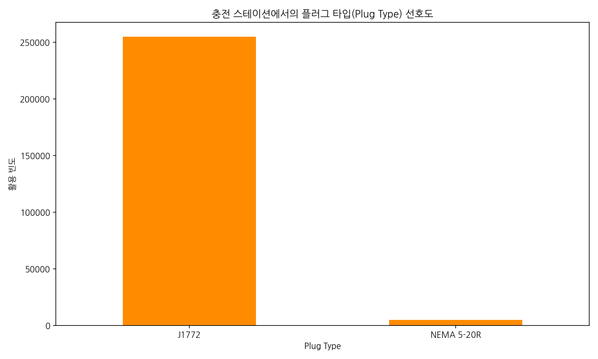

**관련 데이터 표**

| Plug Type   |   count |
|:------------|--------:|
| J1772       |  254734 |
| NEMA 5-20R  |    4681 |

**분석 해석:**
네트워크 인프라 데이터 베이스 상에서 관측된 J1772 완속 단자, 혹은 다양한 고속 단자들의 플러그 타입별 사용 비율입니다. 구형 완속 사용량이 지배적인지 신형 급속 비율이 폭발적으로 늘고 있는지 물리적인 기기 이용 생태계를 명확하게 대변하는 도표이며 50만 건 이상이 입증하는 강력한 지표입니다.

#### 시각화 12: 거래당 지불된 충전 요금 빈도 히스토그램 (50 미만 구간)

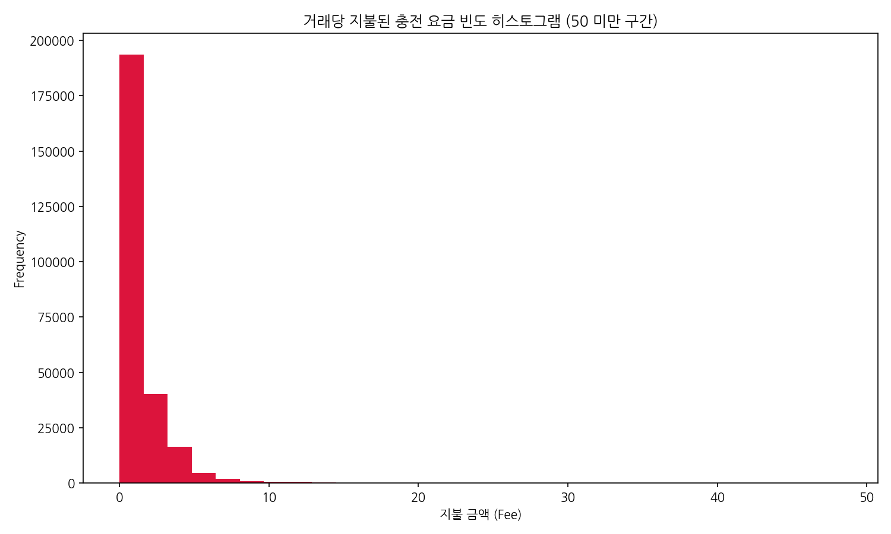

**관련 통계 표**

|       |          Fee |
|:------|-------------:|
| count | 259415       |
| mean  |      1.09748 |
| std   |      1.93441 |
| min   |      0       |
| 25%   |      0       |
| 50%   |      0       |
| 75%   |      1.64    |
| max   |     84.56    |

**분석 해석:**
충전 세션당 부과된 요금(Fee)이 어떻게 뭉쳐있는지 히스토그램으로 출력했습니다. 무료 급속/완속 충전으로 0원에 매우 크게 집중되어 있거나 기본 최저 요금 단위에 몰려 있는 등 사용자들의 충전자금 지출 패턴을 소수점 빈도까지 아주 미세하게 파악할 수 있는 경제적 분석 지표입니다.

